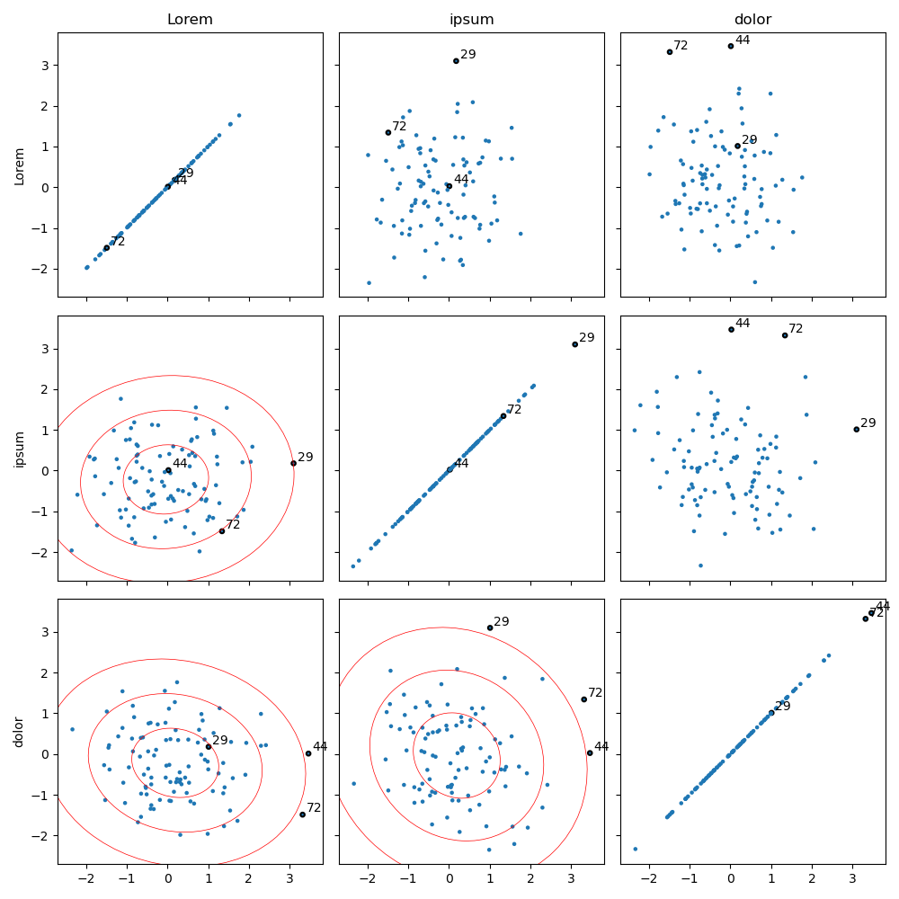

# VizOut 2

*A Python Matplotlib GUI to select outliers in tabular numerical data interactively.*

## Quickstart

``` python
import pandas as pd

from vizout2 import OutlierSelector

# generate test data
data = pd.DataFrame(dict({column : np.random.randn(100) for column in ["Lorem", "ipsum", "dolor"]}))

# select outliers with the mouse
# (hint: hold Ctrl to select multiple points)
selector = OutlierSelector(data, markersize=0.05, n_std=3)

# close figure and extract the dataframe index of each marked outlier
print(selector.get_outliers())

```


